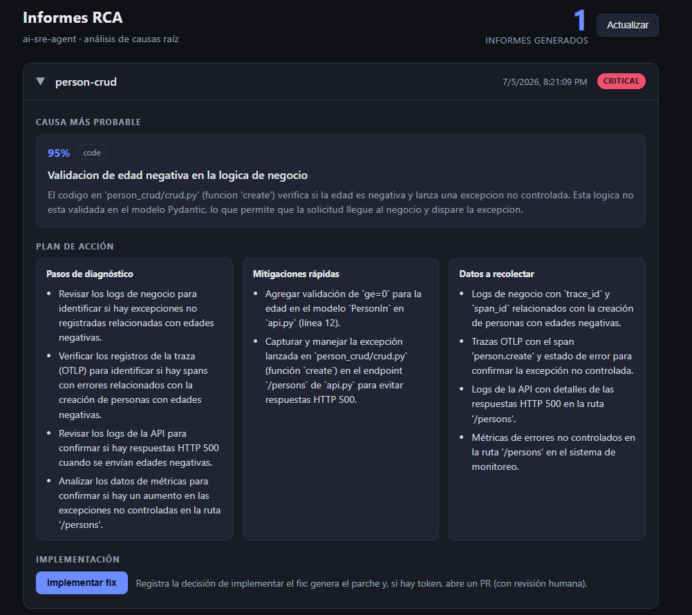

# ai-sre-agent

Webhook que, al recibir un body con un error/alerta, lanza un **flujo agéntico
de análisis de causas raíz (RCA)** usando un modelo local de **Ollama**
(`qwen3:8b` por defecto). Sin dependencias externas: solo Node.js.

## Flujo agéntico

El body entrante pasa por una cadena de 3 pasos, cada uno alimenta al siguiente:

1. **Triage** — normaliza el error, extrae servicio, tipo, severidad y señales clave.
2. **Hipótesis** — genera las causas raíz más probables, ordenadas por confianza.
3. **Plan** — propone pasos de diagnóstico, mitigaciones rápidas y datos a recolectar.

## Requisitos

- Node.js >= 20 (usa `fetch` y `http` nativos)
- Ollama corriendo en local con un modelo descargado:
  ```
  ollama pull qwen3:8b
  ```

## Uso

```bash
npm start            # arranca el servidor en http://localhost:3000
npm run dashboard    # arranca el dashboard en http://localhost:4000
npm run test:webhook # envia un error de ejemplo y muestra el informe
```

Llamada manual:

```bash
curl -X POST http://localhost:3000/webhook \
  -H "Content-Type: application/json" \
  -d '{"service":"checkout-api","level":"error","message":"connection timeout to db"}'
```

## Configuración (variables de entorno)

| Variable         | Por defecto              | Descripción                                  |
|------------------|--------------------------|----------------------------------------------|
| `PORT`           | `3000`                   | Puerto del servidor                          |
| `WEBHOOK_PATH`   | `/webhook`               | Ruta del webhook                             |
| `WEBHOOK_TOKEN`  | *(vacío)*                | Si se define, exige header `X-Webhook-Token` |
| `OLLAMA_HOST`    | `http://localhost:11434` | Servidor de Ollama                           |
| `OLLAMA_MODEL`   | `qwen3:8b`               | Modelo a usar                                |

## Endpoints

- `POST /webhook` — recibe el body (JSON o texto) y devuelve el informe RCA.
- `GET /health` — healthcheck.

## Dashboard

Un servidor aparte (`dashboard.js`, sin dependencias) sirve un frontend sencillo
para revisar los informes guardados en `reports/`:

```bash
npm run dashboard    # http://localhost:4000
```

Muestra la cantidad de informes generados y, por cada uno, el nombre de la API
(`triage.service`), la hora de creación y un badge de severidad. Al expandir una
fila se ve la **causa más probable** (la de mayor `confidence`), el **plan de
acción** y un botón **«Implementar fix»**.



Al pulsar **«Implementar fix»** el agente **construye el parche** del bug en una
**rama** con **dos commits atómicos** (Conventional Commits): primero un
**`test:`** de regresión que reproduce el bug, luego el **`fix:`** del código
productivo. Para cada uno le pide al LLM **ediciones quirúrgicas** (bloques
`old`/`new` de coincidencia exacta, que preservan docstrings y comentarios).

Como respaldo del cambio, verifica el **antes/después**: si detecta un runner de
tests disponible (`npm`/`pytest`), ejecuta la suite y comprueba que el test
**falla sin el fix** y **pasa con él** (rojo→verde). Si el runtime no está
disponible, cae a **modo documentado**: crea los commits igualmente y lo deja
constar en el PR para su confirmación en CI.

Por defecto (sin `GITHUB_TOKEN`) corre en **dry-run** y muestra el **diff
propuesto** (test + fix) sin tocar el remoto. Con un `GITHUB_TOKEN` con permiso de
PR, **hace push y abre un Pull Request** (con revisión humana; **nunca**
auto-merge). El resultado (diff o enlace al PR) queda persistido en el informe.

Requiere que el informe tenga **contexto de código** (`code_context.repo`), es
decir, que el incidente venga de un servicio instrumentado que publique
`vcs.repository.url.full`. Si no, el caso de uso responde `status: "skipped"`.

| Variable         | Por defecto | Descripción                       |
|------------------|-------------|-----------------------------------|
| `DASHBOARD_PORT` | `4000`      | Puerto del dashboard              |
| `REPORTS_DIR`    | `./reports` | Carpeta de informes que lee       |

Endpoints del dashboard:

- `GET /` — el dashboard (HTML).
- `GET /api/reports` — resumen JSON de los informes, ordenado por fecha desc.
- `POST /api/reports/{id}/implement` — caso de uso «implementar fix»: genera el
  parche y (con token) abre un PR. Devuelve `status` (`dry_run` | `pr_opened` |
  `skipped` | `failed`) y persiste el resultado en el informe. `id` es el nombre de
  fichero del informe; se valida contra path traversal.

### Variables del caso de uso «implementar fix»

| Variable            | Por defecto          | Descripción                                             |
|---------------------|----------------------|---------------------------------------------------------|
| `GITHUB_TOKEN` / `GH_TOKEN` | *(vacío)*    | Token con permiso de PR. Sin él → **dry-run** (solo diff). |
| `IMPLEMENT_DRY_RUN` | *(vacío)*            | `1`/`true` fuerza dry-run aunque haya token.            |
| `REPO_ALLOWED_HOSTS`| `github.com`         | Hosts permitidos para clonar/abrir PR.                  |
| `FIX_WORKDIR`       | `./work-fix`         | Carpeta donde se clona el repo para el fix.             |
| `FIX_GIT_NAME` / `FIX_GIT_EMAIL` | `ai-sre-agent` / `ai-sre-agent@localhost` | Autor del commit del fix. |
| `FIX_TEST_RUN`      | `auto`               | `off` desactiva la ejecución de tests (solo modo documentado). |
| `FIX_TEST_TIMEOUT_MS` | `120000`           | Timeout de la ejecución de la suite de tests.           |

## Respuesta

```jsonc
{
  "ok": true,
  "generated_at": "...",
  "duration_ms": 8123,
  "triage": { "service": "...", "severity": "high", "key_signals": ["..."] },
  "probable_causes": [
    { "cause": "...", "confidence": 0.8, "category": "infra", "reasoning": "..." }
  ],
  "action_plan": {
    "next_steps": ["..."],
    "quick_mitigations": ["..."],
    "data_to_collect": ["..."]
  }
}
```
